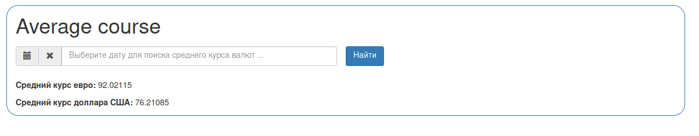

Yii2 library
============
Average currency courses

Есть 2 сервиса, возвращающие курсы валют:

https://www.cbr.ru/development/SXML/

https://cash.rbc.ru/cash/json/converter_currency_rate/?currency_from=USD&currency_to=RUR&source=cbrf&sum=1&date=
Необходимо написать библиотеку, которая будет вычислять средний курс евро и доллара по этим двум сервисам на передаваемую дату.

Installation
------------

The preferred way to install this extension is through [composer](http://getcomposer.org/download/).

Either run

```
php composer.phar require --prefer-dist olesiavm/yii2-currency "*"
```

or add

```
"olesiavm/yii2-currency": "*"
```

to the require section of your `composer.json` file.


Usage
-----

Once the extension is installed, simply use it in your code by  :

```php
<?php
    //action    
    public function actionCourses()
    {
        if (Yii::$app->request->isPost && Yii::$app->request->post('searchDate')) {
            $searchDate = Yii::$app->request->post()['searchDate'];
            $course = new \olesiavm\currency\Course();
            $averageCourses = $course->getAverageCourse($searchDate);
        }
        $averageCourses = isset($averageCourses) ? $averageCourses : null;

        return $this->render('course', [
            'averageCourses' => $averageCourses
        ]);
    } 
    

    //view
    /* @var $this yii\web\View */
    use yii\helpers\Html;
    use kartik\date\DatePicker;
    
    $this->title = 'Average course';
    ?>
    <div class="container" style="border: 1px solid #337ab7; border-radius: 20px;">
        <h1><?= Html::encode($this->title) ?></h1>
        <p></p>
        <div class="row">
            <form method="post">
                <input type="hidden" name="_csrf">
                <div class="col-md-6">
                    <?= DatePicker::widget([
                        'name' => 'searchDate',
                        'options' => ['placeholder' => 'Выберите дату для поиска среднего курса валют ...'],
                        'pluginOptions' => [
                            'format' => 'dd.mm.yyyy',
                            'todayHighlight' => true
                            ]
                    ]); ?>
                </div>
                <div class="form-group">
                    <?= Html::submitButton('Найти', ['class' => 'btn btn-primary', 'name' => 'course-button']) ?>
                </div>
            </form>
        </div>
        <?php if ($averageCourses): ?>
            <div>
                <p></p>
                <p><b>Средний курс евро:</b>  <?= $averageCourses['averageEur'] ?></p>
                <p><b>Средний курс доллара США:</b>  <?= $averageCourses['averageUsd'] ?></p>
            </div>
        <?php endif; ?>
    </div>
?>
```
​